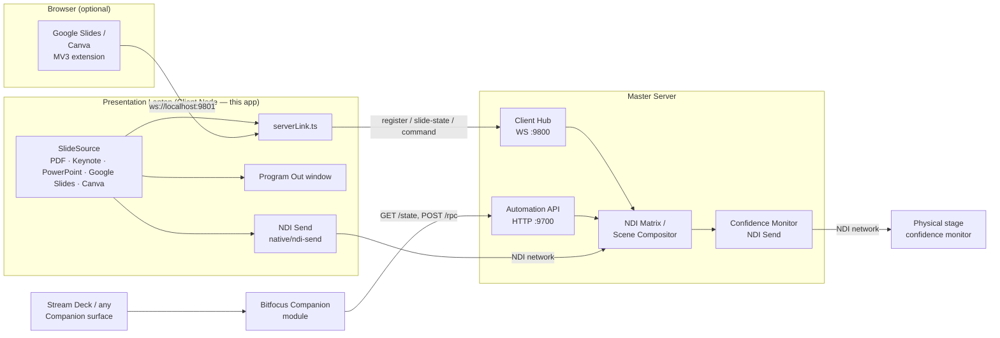

# Presentation Commander — Client

> **AI-assisted project.** This codebase was created with [Claude](https://claude.com/claude-code)
> (Anthropic), directed and reviewed by a human author — including architecture,
> implementation, and documentation. Review it accordingly before relying on it in
> production.

The presentation laptop companion app for
[presentation-commander-server](https://github.com/allansargeant/presentation-commander-server).
A bespoke PDF presentation engine built as an Electron + React + TypeScript
desktop app — no PowerPoint or Keynote dependency.


## What it does

- **Bespoke PDF engine** — open a PDF, get Now/Next slide previews rendered
  locally with pdf.js. Internal links authored into the PDF (a table of
  contents, "back to agenda" links exported from PowerPoint/Keynote/Google
  Slides) are clickable on the "Now" slide, jumping straight to their target
  page — reads link annotations via pdf.js, resolving each destination to a
  page number regardless of whether it's named or explicit; PDF-only, since
  it's exposed as an optional `getLinks` on `SlideSource` that only
  `pdfSource.ts` implements
- **Keynote integration** (macOS) — drive a real, currently-open Keynote
  slideshow directly via AppleScript instead of a pre-exported PDF: slide
  count and presenter notes are pulled on open, navigating in our UI
  advances the real Keynote window, and advancing Keynote itself (clicker,
  arrow keys) is polled and reflected back within ~400ms
- **PowerPoint integration** (macOS and Windows) — same idea as Keynote,
  platform-appropriate mechanism: AppleScript on macOS, PowerShell COM
  automation (`New-Object -ComObject PowerPoint.Application`) on Windows,
  behind the same `SlideSource` interface either way. Slide count and
  presenter notes are pulled on open; navigating in our UI drives the real
  PowerPoint editing view. On macOS, PowerPoint's AppleScript dictionary has
  no working bulk slide-image export (`save … as PNG/PDF` is declared but is
  a silent no-op in the tested version), so frames are captured one slide at
  a time via `copy object` + reading the resulting image off the system
  clipboard. On Windows, `Slide.Export(path, "PNG", w, h)` genuinely works,
  so export is a plain bulk loop — no clipboard round-trip needed. Neither
  platform drives PowerPoint's own fullscreen slideshow mode (confirmed
  unreliable under automation/virtualization on both — same class of issue
  as Keynote's `start`/`show`); the editing view's current slide is enough
  for everything this app needs, since Program Out/NDI is what the audience
  actually sees
- **Live capture for Keynote/PowerPoint** (macOS) — an alternative to the
  static pre-exported-PNG frames above: captures the real on-screen display
  live via `getDisplayMedia`, so animations, transitions, and embedded video
  playback actually show up in the NDI output, not just a still image of
  however the slide looked at export time. Opt-in per stream (Program and/or
  Next Slide) via a gear icon next to each NDI toggle, which lists capturable
  screens and offers an optional crop region (X/Y/W/H %) for isolating a
  sub-area — e.g. just the "next slide" box out of a captured Presenter
  Display that shows current + next + notes together. Two things had to be
  fixed to make this reliable: the video element receiving the stream must
  be attached to the DOM (a detached one stops receiving frames after a few
  seconds — a Chromium resource-management heuristic based on visibility,
  confirmed live), and the window needs `backgroundThrottling: false` in
  `webPreferences`, since Chromium throttles `setInterval` hard enough to
  stall the capture loop within seconds once backgrounded — which this app
  is, by design, during real use (Keynote/PowerPoint is what's actually
  frontmost while presenting). Fullscreen presentation windows aren't
  enumerable via `desktopCapturer`'s window-level sources on macOS (confirmed
  live — they sit above whatever window level that query reads), so this
  captures a whole physical display rather than a specific window, matching
  the existing Program Out display-picker's screen-based approach.
- **Canva integration** — connects to a live Canva Presenter Window (opened
  via Present → Presenter view) through the same browser-extension bridge as
  Google Slides. Unlike Slides, Canva has no public API for speaker notes or
  slide state, so both are scraped directly from the Presenter Window's DOM:
  current slide index from its "N / M" counter, the frame from the untainted
  `<canvas>` it renders slides onto (`canvas.toDataURL()`, no `chrome.tabCapture`
  needed), and notes text from a `<span>` Canva renders once notes are
  non-empty — the notes `<textarea>` itself only exists as an "Add notes…"
  placeholder prompt when notes are empty, so it can't be read directly.
  Navigating in our UI dispatches synthetic arrow-key events into the
  Presenter Window, mirroring Google Slides' approach
- **Presenter notes** — per-slide notes, auto-saved to a `.notes.json`
  sidecar file next to the PDF
- **Transport** — Previous/Next buttons, a clickable "Next" preview, and
  keyboard navigation (Left/Right, Up/Down, Page Up/Page Down, Space)
- **Program Out** — a second, fullscreen, chrome-free window showing just
  the current slide, for a projector or confidence monitor. Pick which
  connected display it opens on from a dropdown next to the button. Press
  `B`/`W` to blank it to solid black/white without losing your place
  (matches PowerPoint's presenter shortcuts), and an optional checkbox
  hides the OS cursor over it
- **NDI Output** — two independent, separately-toggleable NDI video sources
  on the network: **Program Out** (the current slide) and **Next Slide
  NDI** (the upcoming slide, using the same render path as the Now/Next
  preview), so a second receiver — a stage monitor showing what's coming
  next, a director's preview feed — can pick up the next slide without
  needing the server's composited Confidence Monitor path. Built directly
  against the official [Vizrt NDI SDK](https://ndi.video/for-developers/ndi-sdk/)
  via a small native N-API addon (`native/ndi-send`) — no third-party NDI
  wrapper. Both are independent of whether the Program Out window is open,
  since NDI is a network output rather than a local display
- **Server link** — connects to the Master Server's client hub over
  WebSocket (`ws://<host>:9800`), registers itself by name, pushes live
  slide/notes state, and accepts remote next/previous-slide commands
  triggered from the server's Control Surface
- **OSC control** — a UDP OSC address space (slide navigation, black/white,
  notes, Program Out open/close, system enable/disable) at
  `/presentcommander/...`, across every source type — PDF, Keynote,
  PowerPoint, Google Slides, Canva. Plain UDP rather than a Windows COM
  add-in, so it works on every platform this app ships for. A real
  Bitfocus Companion module ships alongside this app —
  [companion-module-presentation-commander-client](https://github.com/allansargeant/companion-module-presentation-commander-client)
  — for driving it from a Stream Deck or any other Companion surface. An
  optional, off-by-default "watched folder" feature lets OSC open a
  specific PDF/Keynote/PowerPoint file by filename without a dialog —
  useful for a button wall that loads a specific deck on cue. Sections
  (`goto/section`) are mapped from a PDF's own outline/bookmarks, or from
  PowerPoint's native COM `SectionProperties` on Windows — Keynote,
  Google Slides, Canva, and PowerPoint on Mac have no native section
  concept to map from, so they report none rather than fabricating one.
  `/presentcommander/slideshow/laserpointer` mirrors the presenter's mouse
  position over the "Now" preview onto Program Out as a glowing dot,
  matching PowerPoint's own laser-pointer feature — source-agnostic,
  since it's purely a display overlay independent of slide content. Media
  control (`/presentcommander/media/play|pause|playpause|stop` and a
  `media/duration` feedback) works only for PowerPoint on Windows, and only
  when the presenter has a live PowerPoint slideshow running independently
  of this app (e.g. started directly in PowerPoint) — it's a keyboard-
  shortcut toggle under the hood, since PowerPoint's COM object model has
  no direct play/pause method. Not available anywhere else: confirmed via
  direct inspection of both Keynote's and PowerPoint-for-Mac's scripting
  dictionaries that neither exposes any playback control at all.
  `/presentcommander/slideshow/setwallpaper` renders whatever's currently
  on screen and sets it as the desktop wallpaper on every connected
  monitor — source-agnostic (works for every source type via the same
  `renderFrame` every SlideSource already implements). macOS and Windows
  are fully covered, Linux is GNOME-only. **Timed auto-advance** — an
  optional "advance every N seconds" mode (stops at the last slide rather
  than looping), with its own play/pause control next to the OSC
  settings — `/presentcommander/slideshow/pause` and `/resume` suspend/resume
  it remotely once it's turned on, and are a no-op if it was never enabled

## Architecture



### Building from source

The native send addon links against the NDI SDK at build time. Install
the [NDI SDK](https://ndi.video/for-developers/ndi-sdk/) first (macOS
default: `/Library/NDI SDK for Apple`; override the location with
`NDI_SDK_DIR` if yours lives elsewhere). `npm install` rebuilds the addon
automatically via `@electron/rebuild`.

### Google Slides / Canva bridge (optional)

`extension/` is one unpacked Chrome extension that lets the Client connect
to a live Google Slides Presenter View or a live Canva Presenter Window
instead of a local PDF/Keynote file — load it via `chrome://extensions` →
Developer mode → Load unpacked. Both platforms relay through the same local
WebSocket bridge (`ws://localhost:9801`); an `app` field on every message
tells the Client which `SlideSource` it belongs to. Fetching Google Slides
speaker notes needs a one-time OAuth client registration in Google Cloud
Console — click the ⚙ next to "Connect Google Slides…" in the app for
step-by-step in-app instructions and a field to paste the client ID
directly into `extension/manifest.json` (no manual file editing needed;
still requires one manual reload of the extension at `chrome://extensions`
afterward, since Chrome only picks up manifest changes on reload). The full
walkthrough is also written out at
[`extension/OAUTH_SETUP.md`](extension/OAUTH_SETUP.md). Canva needs no
OAuth setup — its notes and slide state are scraped directly from the
Presenter Window's DOM, not fetched from an API.

Note for MV3 service worker reliability: the extension's background
service worker calls `connect()` defensively on every incoming message
rather than relying solely on its `setTimeout`-based reconnect loop —
Chrome discards pending timers when it suspends an idle service worker, so
a `setTimeout` reconnect scheduled just before suspension would otherwise
never fire.

## Status

Feature-complete for its current scope: the bespoke PDF engine, Keynote
(macOS), PowerPoint (macOS and Windows), Google Slides, and Canva sources,
dual NDI outputs (Program + Next Slide), live capture for Keynote/PowerPoint,
presenter notes, Program Out window, and the Master Server link / Control
Surface integration are all built and verified. Keynote drive and live
capture are macOS-only (no Windows equivalent exists yet for either); PDF,
Google Slides, and Canva work on both platforms.

## Inspiration & prior art

This app's OSC control feature, its PowerPoint-media-control research, and
its wallpaper-export feature were all shaped by looking at how existing
remote-PowerPoint-control tools work. Being specific about what was and
wasn't reused:

- **[OSCPoint](https://github.com/phuvf/oscpoint)** — a Windows PowerPoint
  add-in exposing an OSC API. It's closed-source, so nothing was copied
  from it; its public documentation (`ACTIONS.md`/`FEEDBACKS.md`/`EVENTS.md`/
  `PRESENTATION.md`) was read to design a comparable address space and the
  two-port (action-in/feedback-out) architecture this app uses. That
  address space originally mirrored OSCPoint's own (`/oscpoint/...`,
  matching ports) for drop-in Companion compatibility; it's since been
  renamed to `/presentcommander/...` and decoupled from OSCPoint entirely,
  now that this app has its own dedicated Companion module instead.
- **[benkuper/PowerPoint-OSC](https://github.com/benkuper/PowerPoint-OSC)**
  and **[leonreucher/powerpoint-remote-websocket](https://github.com/leonreucher/powerpoint-remote-websocket)** —
  two public, open-source VSTO (C#/.NET) PowerPoint add-ins. Their real
  source was read specifically to answer one question during this app's
  PowerPoint media-control work: is external COM automation of PowerPoint's
  slideshow/media actually viable at all? Reading both confirmed that
  `SlideShowSettings.Run()` is a normal, working COM call in practice, and
  that neither add-in ever calls a direct Play()/Pause() method on a media
  shape — only detects/counts them — which is what led to this app's own
  Alt+P `SendKeys` toggle in `powerpointBridgeWin.ts` instead of a
  (nonexistent) direct COM method. No C#/VSTO code was ported: both
  reference add-ins run in-process inside PowerPoint, while this app
  automates PowerPoint externally via PowerShell COM calls — a different
  enough architecture that reuse wasn't really possible, only the factual
  understanding of what PowerPoint's COM model does and doesn't expose.
- **[Iris Down Remote Show Control](https://irisdown.co.uk/rsc.html)** — an
  older, separate commercial PowerPoint add-in taking plain ASCII text
  commands (`NEXT`, `PREV`, `GO`, `RUNCURRENT`, `SETBG`, …) over UDP/TCP,
  with no feedback channel at all. Its command set overlaps conceptually
  with several features here — slide navigation, starting from the current
  slide, and notably `SETBG`'s "set desktop wallpaper to the current
  slide," which this app's own wallpaper-export feature does the same
  thing as. Nothing was read from its source (it isn't public) or its wire
  format (plain text vs. this app's OSC) — the overlap is in feature
  scope, not implementation.

## Project Setup

### Install

```bash
npm install
```

### Development

```bash
npm run dev
```

### Build

```bash
# Windows
npm run build:win

# macOS
npm run build:mac

# Linux
npm run build:linux
```

## Unsigned builds — macOS Gatekeeper & Windows SmartScreen

The release builds are **not code-signed or notarized** — that needs paid Apple
/ Windows developer certificates this project doesn't carry. The app is safe to
run; the OS just can't verify a publisher, so it warns you the first time.
Here's how to get past that, and how to sign it yourself if you'd rather.

### macOS

Delivered as a `.dmg`/`.zip`. On first launch macOS says the app **"is damaged
and can't be opened"** or **"cannot be opened because the developer cannot be
verified"** — that's Gatekeeper reacting to the missing signature, not an actual
problem.

Easiest fix: **right-click (Control-click) the app in Applications → Open →
Open**. You only do this once. If it still says *"damaged"* (common when the
`.dmg` came through a browser), clear the quarantine flag in Terminal:

```sh
xattr -dr com.apple.quarantine "/Applications/Presentation Commander Client.app"
```

### Windows

The installer is an unsigned `.exe`, so SmartScreen shows **"Windows protected
your PC"** → click **More info → Run anyway**. (Right-click → **Properties** →
**Unblock** also works.)

### Linux

`.AppImage`: `chmod +x` it and run. `.deb`: `sudo apt install ./<file>.deb`. No
signing gate.

### Signing it yourself (optional)

macOS ad-hoc (local only, not notarized):

```sh
codesign --force --deep --sign - "/Applications/Presentation Commander Client.app"
```

To ship without warnings you need an **Apple Developer Program** membership
($99/yr) + a *Developer ID Application* certificate, then sign with the hardened
runtime and notarize with `xcrun notarytool submit … --wait` and
`xcrun stapler staple`. electron-builder does all of this for you if you set
`CSC_LINK`, `CSC_KEY_PASSWORD`, `APPLE_ID`, `APPLE_APP_SPECIFIC_PASSWORD` and
`APPLE_TEAM_ID`. On Windows, clearing SmartScreen needs an Authenticode
code-signing certificate (`signtool sign`, or `CSC_LINK`/`CSC_KEY_PASSWORD` for
electron-builder).

## Recommended IDE Setup

- [VSCode](https://code.visualstudio.com/) + [ESLint](https://marketplace.visualstudio.com/items?itemName=dbaeumer.vscode-eslint) + [Prettier](https://marketplace.visualstudio.com/items?itemName=esbenp.prettier-vscode)
