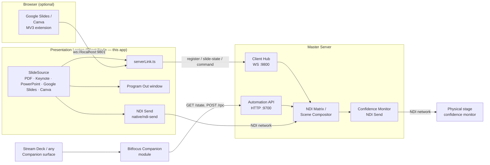

# Presentation Commander — Client

> **AI-assisted project.** This codebase was created with [Claude](https://claude.com/claude-code)
> (Anthropic), directed and reviewed by a human author — including architecture,
> implementation, and documentation. Review it accordingly before relying on it in
> production.

The presentation laptop companion app for
[presentation-commander-server](https://github.com/allansargeant/presentation-commander-server).
A bespoke PDF presentation engine built as an Electron + React + TypeScript
desktop app — no PowerPoint or Keynote dependency.


## What it does

- **Bespoke PDF engine** — open a PDF, get Now/Next slide previews rendered
  locally with pdf.js
- **Keynote integration** (macOS) — drive a real, currently-open Keynote
  slideshow directly via AppleScript instead of a pre-exported PDF: slide
  count and presenter notes are pulled on open, navigating in our UI
  advances the real Keynote window, and advancing Keynote itself (clicker,
  arrow keys) is polled and reflected back within ~400ms
- **PowerPoint integration** (macOS and Windows) — same idea as Keynote,
  platform-appropriate mechanism: AppleScript on macOS, PowerShell COM
  automation (`New-Object -ComObject PowerPoint.Application`) on Windows,
  behind the same `SlideSource` interface either way. Slide count and
  presenter notes are pulled on open; navigating in our UI drives the real
  PowerPoint editing view. On macOS, PowerPoint's AppleScript dictionary has
  no working bulk slide-image export (`save … as PNG/PDF` is declared but is
  a silent no-op in the tested version), so frames are captured one slide at
  a time via `copy object` + reading the resulting image off the system
  clipboard. On Windows, `Slide.Export(path, "PNG", w, h)` genuinely works,
  so export is a plain bulk loop — no clipboard round-trip needed. Neither
  platform drives PowerPoint's own fullscreen slideshow mode (confirmed
  unreliable under automation/virtualization on both — same class of issue
  as Keynote's `start`/`show`); the editing view's current slide is enough
  for everything this app needs, since Program Out/NDI is what the audience
  actually sees
- **Canva integration** — connects to a live Canva Presenter Window (opened
  via Present → Presenter view) through the same browser-extension bridge as
  Google Slides. Unlike Slides, Canva has no public API for speaker notes or
  slide state, so both are scraped directly from the Presenter Window's DOM:
  current slide index from its "N / M" counter, the frame from the untainted
  `<canvas>` it renders slides onto (`canvas.toDataURL()`, no `chrome.tabCapture`
  needed), and notes text from a `<span>` Canva renders once notes are
  non-empty — the notes `<textarea>` itself only exists as an "Add notes…"
  placeholder prompt when notes are empty, so it can't be read directly.
  Navigating in our UI dispatches synthetic arrow-key events into the
  Presenter Window, mirroring Google Slides' approach
- **Presenter notes** — per-slide notes, auto-saved to a `.notes.json`
  sidecar file next to the PDF
- **Transport** — Previous/Next buttons and arrow-key navigation
- **Program Out** — a second, fullscreen, chrome-free window showing just
  the current slide, for a projector or confidence monitor. Pick which
  connected display it opens on from a dropdown next to the button
- **NDI Output** — two independent, separately-toggleable NDI video sources
  on the network: **Program Out** (the current slide) and **Next Slide
  NDI** (the upcoming slide, using the same render path as the Now/Next
  preview), so a second receiver — a stage monitor showing what's coming
  next, a director's preview feed — can pick up the next slide without
  needing the server's composited Confidence Monitor path. Built directly
  against the official [Vizrt NDI SDK](https://ndi.video/for-developers/ndi-sdk/)
  via a small native N-API addon (`native/ndi-send`) — no third-party NDI
  wrapper. Both are independent of whether the Program Out window is open,
  since NDI is a network output rather than a local display
- **Server link** — connects to the Master Server's client hub over
  WebSocket (`ws://<host>:9800`), registers itself by name, pushes live
  slide/notes state, and accepts remote next/previous-slide commands
  triggered from the server's Control Surface

## Architecture



### Building from source

The native send addon links against the NDI SDK at build time. Install
the [NDI SDK](https://ndi.video/for-developers/ndi-sdk/) first (macOS
default: `/Library/NDI SDK for Apple`; override the location with
`NDI_SDK_DIR` if yours lives elsewhere). `npm install` rebuilds the addon
automatically via `@electron/rebuild`.

### Google Slides / Canva bridge (optional)

`extension/` is one unpacked Chrome extension that lets the Client connect
to a live Google Slides Presenter View or a live Canva Presenter Window
instead of a local PDF/Keynote file — load it via `chrome://extensions` →
Developer mode → Load unpacked. Both platforms relay through the same local
WebSocket bridge (`ws://localhost:9801`); an `app` field on every message
tells the Client which `SlideSource` it belongs to. Fetching Google Slides
speaker notes needs a one-time OAuth client registration in Google Cloud
Console — click the ⚙ next to "Connect Google Slides…" in the app for
step-by-step in-app instructions and a field to paste the client ID
directly into `extension/manifest.json` (no manual file editing needed;
still requires one manual reload of the extension at `chrome://extensions`
afterward, since Chrome only picks up manifest changes on reload). The full
walkthrough is also written out at
[`extension/OAUTH_SETUP.md`](extension/OAUTH_SETUP.md). Canva needs no
OAuth setup — its notes and slide state are scraped directly from the
Presenter Window's DOM, not fetched from an API.

Note for MV3 service worker reliability: the extension's background
service worker calls `connect()` defensively on every incoming message
rather than relying solely on its `setTimeout`-based reconnect loop —
Chrome discards pending timers when it suspends an idle service worker, so
a `setTimeout` reconnect scheduled just before suspension would otherwise
never fire.

## Status

Feature-complete for its current scope: the bespoke PDF engine, Keynote
(macOS), PowerPoint (macOS and Windows), Google Slides, and Canva sources,
dual NDI outputs (Program + Next Slide), presenter notes, Program Out
window, and the Master Server link / Control Surface integration are all
built and verified. Keynote drive is macOS-only (no Windows equivalent
exists); PDF, Google Slides, and Canva work on both platforms.

## Project Setup

### Install

```bash
npm install
```

### Development

```bash
npm run dev
```

### Build

```bash
# Windows
npm run build:win

# macOS
npm run build:mac

# Linux
npm run build:linux
```

## Recommended IDE Setup

- [VSCode](https://code.visualstudio.com/) + [ESLint](https://marketplace.visualstudio.com/items?itemName=dbaeumer.vscode-eslint) + [Prettier](https://marketplace.visualstudio.com/items?itemName=esbenp.prettier-vscode)
