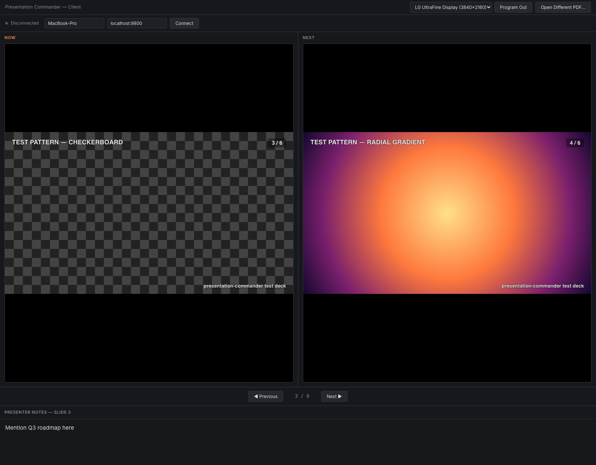
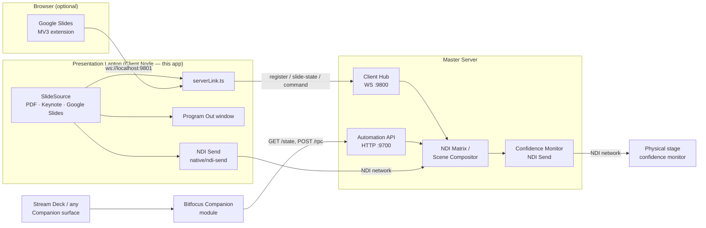

# Presentation Commander — Client

> **AI-assisted project.** This codebase was created with [Claude](https://claude.com/claude-code)
> (Anthropic), directed and reviewed by a human author — including architecture,
> implementation, and documentation. Review it accordingly before relying on it in
> production.

The presentation laptop companion app for
[presentation-commander-server](https://github.com/allansargeant/presentation-commander-server).
A bespoke PDF presentation engine built as an Electron + React + TypeScript
desktop app — no PowerPoint or Keynote dependency.



## What it does

- **Bespoke PDF engine** — open a PDF, get Now/Next slide previews rendered
  locally with pdf.js
- **Keynote integration** (macOS) — drive a real, currently-open Keynote
  slideshow directly via AppleScript instead of a pre-exported PDF: slide
  count and presenter notes are pulled on open, navigating in our UI
  advances the real Keynote window, and advancing Keynote itself (clicker,
  arrow keys) is polled and reflected back within ~400ms
- **Presenter notes** — per-slide notes, auto-saved to a `.notes.json`
  sidecar file next to the PDF
- **Transport** — Previous/Next buttons and arrow-key navigation
- **Program Out** — a second, fullscreen, chrome-free window showing just
  the current slide, for a projector or confidence monitor. Pick which
  connected display it opens on from a dropdown next to the button
- **NDI Output** — two independent, separately-toggleable NDI video sources
  on the network: **Program Out** (the current slide) and **Next Slide
  NDI** (the upcoming slide, using the same render path as the Now/Next
  preview), so a second receiver — a stage monitor showing what's coming
  next, a director's preview feed — can pick up the next slide without
  needing the server's composited Confidence Monitor path. Built directly
  against the official [Vizrt NDI SDK](https://ndi.video/for-developers/ndi-sdk/)
  via a small native N-API addon (`native/ndi-send`) — no third-party NDI
  wrapper. Both are independent of whether the Program Out window is open,
  since NDI is a network output rather than a local display
- **Server link** — connects to the Master Server's client hub over
  WebSocket (`ws://<host>:9800`), registers itself by name, pushes live
  slide/notes state, and accepts remote next/previous-slide commands
  triggered from the server's Control Surface

## Architecture



### Building from source

The native send addon links against the NDI SDK at build time. Install
the [NDI SDK](https://ndi.video/for-developers/ndi-sdk/) first (macOS
default: `/Library/NDI SDK for Apple`; override the location with
`NDI_SDK_DIR` if yours lives elsewhere). `npm install` rebuilds the addon
automatically via `@electron/rebuild`.

### Google Slides bridge (optional)

`extension/` is an unpacked Chrome extension that lets the Client connect
to a live Google Slides Presenter View instead of a local PDF/Keynote
file — load it via `chrome://extensions` → Developer mode → Load
unpacked. Fetching speaker notes needs a one-time OAuth client
registration in Google Cloud Console — click the ⚙ next to "Connect
Google Slides…" in the app for step-by-step in-app instructions and a
field to paste the client ID directly into `extension/manifest.json`
(no manual file editing needed; still requires one manual reload of the
extension at `chrome://extensions` afterward, since Chrome only picks up
manifest changes on reload). The full walkthrough is also written out at
[`extension/OAUTH_SETUP.md`](extension/OAUTH_SETUP.md).

## Status

Feature-complete for its current scope: the bespoke PDF engine, Keynote (macOS)
and Google Slides sources, dual NDI outputs (Program + Next Slide), presenter
notes, Program Out window, and the Master Server link / Control Surface
integration are all built and verified. Keynote drive is macOS-only — other
platforms use the PDF and Google Slides paths.

## Project Setup

### Install

```bash
npm install
```

### Development

```bash
npm run dev
```

### Build

```bash
# Windows
npm run build:win

# macOS
npm run build:mac

# Linux
npm run build:linux
```

## Recommended IDE Setup

- [VSCode](https://code.visualstudio.com/) + [ESLint](https://marketplace.visualstudio.com/items?itemName=dbaeumer.vscode-eslint) + [Prettier](https://marketplace.visualstudio.com/items?itemName=esbenp.prettier-vscode)
